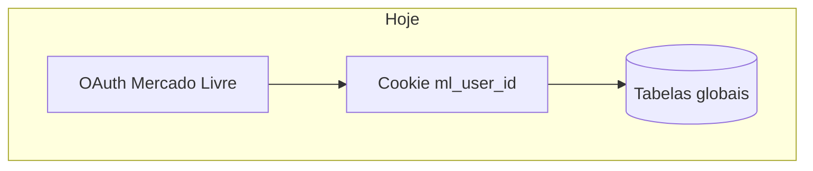
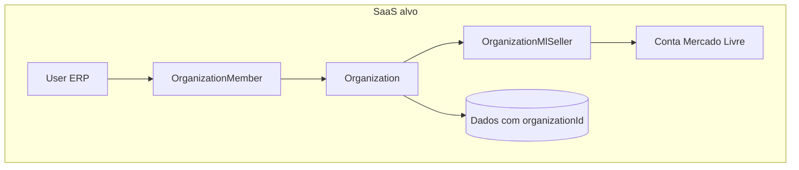

# Migração SaaS multi-tenant

Este documento descreve o estado **single-tenant** atual do ERP, o modelo **SaaS** alvo (organização + usuários ERP + vínculo Mercado Livre) e o que precisa mudar. É um registro vivo: toda feature nova que toca dados, APIs ou auth deve ganhar uma entrada na seção [Registro de features](#registro-de-features).

Modelo de dados proposto: [tenant-data-model.md](tenant-data-model.md).  
Template para novas entradas: [feature-saas-impact.md](../templates/feature-saas-impact.md).

---

## Resumo executivo

Hoje o sistema é **um deployment = uma empresa**. Login é OAuth do Mercado Livre; a sessão identifica o seller ML (`ml_user_id`), não um usuário ERP. A maior parte dos dados (produtos, DRE, listings, config fiscal) vive em tabelas **globais** sem `organizationId`.

Para vender como SaaS, o alvo é:

- **Organization** = cliente que paga pelo ERP
- **User** = pessoas da equipe do cliente (com papéis)
- **OrganizationMlSeller** = contas ML conectadas à org
- **Todas** as queries de negócio filtradas por `organizationId`

Estratégia: **um banco, multi-tenant por linha** (row-level), não um deployment por cliente.

---

## Estado atual

### Autenticação

| Aspecto | Hoje |
|---------|------|
| Login | Apenas OAuth ML (`/api/auth/mercadolibre/*`) |
| Sessão | Cookies `ml_access_token`, `ml_user_id`, etc. — `src/lib/mercadolibre/session.ts` |
| Proteção de rotas | Inline em ~25 API routes + `dashboard/layout.tsx`; sem `middleware.ts` |
| Modelo User/Org | **Não existe** no Prisma |

### Escopo parcial por seller ML

Algumas tabelas já usam `sellerId` / `mlUserId`:

| Modelo | Escopo |
|--------|--------|
| `TaxReportMonthSnapshot` | `@@unique([sellerId, year, month])` |
| `MlSellerCredentials` | PK `mlUserId` |
| `PushSubscription` | `mlUserId` + endpoint |

O restante do app **não** isola dados entre sellers: dois logins ML no mesmo DB veriam o mesmo catálogo de produtos e o mesmo DRE.

### Bloqueadores críticos

| Área | Problema | Arquivos |
|------|----------|----------|
| Config fiscal | Singleton `CompanyTaxSettings.id = "default"` | `src/lib/product-data.ts`, `src/lib/tax-report/tax-config-data.ts` |
| Produtos | PK global `sku` | `prisma/schema.prisma`, `src/app/api/products/*` |
| DRE | `@@unique([year, month])` — um snapshot/mês para todo o DB | `src/lib/dre-month-data.ts` |
| Listings / estoque | Sem `organizationId` | `src/lib/dashboard-purchase-data.ts`, páginas de inventory |
| Cron catálogo | Um seller (`CRON_ML_USER_ID` ou primeiro credential) | `src/lib/catalog-competition-poll.ts` |
| App ML | Credenciais globais no `.env` | `src/lib/mercadolibre/config.ts` |

---

## Modelo alvo

Detalhes dos modelos: [tenant-data-model.md](tenant-data-model.md).

---

## Classificação das tabelas Prisma (hoje)

| Classificação | Modelos |
|---------------|---------|
| **Referência global** (compartilhável) | `CbsIbsVigencia`, `TaxpayerVerificationCache` |
| **Referência editável** (hoje global; pode virar override por org) | `IcmsInternalRate` |
| **Por tenant** (hoje sem coluna — precisa `organizationId`) | `Product`, `CompanyTaxSettings`, `Listing`, `WarehouseStock`, `ReplenishmentCycle`, `CatalogCompetitionSnapshot`, `StockAttentionAcknowledgement`, `DreCostItem`, `DreCostMonthValue`, `DreMonthSnapshot`, `CatalogCompetitionPollRun` |
| **Parcial ML** (seller como proxy) | `TaxReportMonthSnapshot`, `MlSellerCredentials`, `PushSubscription` |

---

## Mapa de mudanças por camada

### 1. Schema

- Novos modelos: `Organization`, `User`, `OrganizationMember`, `OrganizationMlSeller`
- `organizationId` em todas as tabelas de negócio
- Ajuste de uniques: `(organizationId, sku)`, `(organizationId, year, month)` no DRE, etc.
- Backfill: org `default` para dados existentes

### 2. Auth e sessão

- Login ERP (decisão futura: email, magic link ou SSO)
- ML OAuth = integração, não identidade principal
- `requireOrganization(session)` centralizado
- Sessão com `userId` + `organizationId` + `mlUserId` ativo

### 3. Libs / loaders

| Módulo | Arquivos principais |
|--------|---------------------|
| Produtos | `src/lib/product-data.ts` |
| DRE | `src/lib/dre-month-data.ts`, `src/lib/dre-year-data.ts` |
| Relatório tributário | `src/lib/tax-report/tax-config-data.ts`, `src/lib/tax-report/service/generate-monthly-report.ts` |
| Compras / estoque | `src/lib/dashboard-purchase-data.ts`, `src/lib/replenishment-cycle-data.ts` |
| Catálogo | `src/lib/catalog-competition-poll.ts` |
| Avaliação financeira | `src/lib/financial-evaluation-data.ts` |

### 4. API routes (sem escopo hoje — prioridade alta)

- `src/app/api/products/*`
- `src/app/api/dre/*`
- `src/app/api/company-tax-settings/route.ts`
- `src/app/api/tax-config/route.ts`
- `src/app/api/reports/catalog-competition/*`
- Webhook: `src/app/api/ml/notifications/catalog-competition/route.ts`
- Cron: `src/app/api/cron/catalog-competition/route.ts`

### 5. Frontend

- Contexto de organização ativa (header / seletor)
- URLs: org na sessão (v1) ou `/org/[slug]/...` (v2)

### 6. Infra

- Um deployment + PostgreSQL multi-tenant
- `ENCRYPTION_KEY` global; tokens ML por seller (ok)
- Billing e planos — fase posterior

---

## Roadmap de fases

| Fase | Escopo | Entregável |
|------|--------|------------|
| **0 — Doc** | Este documento + processo em AGENTS.md | Time alinhado |
| **1 — Contexto** | Modelo `Organization` + helper `requireOrganization` | Código novo já tenant-aware |
| **2 — Schema** | `organizationId` + backfill | Isolamento de dados |
| **3 — APIs** | Escopar rotas e libs existentes | Sem vazamento entre orgs |
| **4 — Auth ERP** | Users, convites, papéis | Produto vendável |
| **5 — Produto SaaS** | Onboarding, billing | Go-to-market |

---

## Registro de features

Entradas ordenadas da mais recente para a mais antiga. Use o [template](../templates/feature-saas-impact.md).

### Custo de precificação + Imposto na tela de produtos vindos do relatório tributário — 2026-07-29

- **Tabelas novas/alteradas:** nenhuma — passou a ler `tax_report_month_snapshots` (já existente) a partir de `GET /api/products`
- **Precisa `organizationId`?** sim, no futuro — hoje usa `sellerId` (userId da sessão ML), mesmo padrão de `loadLatestTaxReportSnapshot`
- **APIs afetadas:** `GET /api/products` (agora chama `loadProductTaxFromLatestReport(sellerId)` e retorna `taxReportGeneratedAt`)
- **Assume singleton?** não — usa o snapshot mais recente por `sellerId` (`findFirst orderBy year/month desc`), sem `id: "default"`
- **Cron/background:** nenhum
- **Dados globais vs por org:** `Product` (custo/IPI/ICMS-ST) continua global; o percentual de imposto agora vem por `sellerId`, via `src/lib/product-tax-from-report.ts`
- **Código já tenant-ready?** parcial — `loadProductTaxFromLatestReport(sellerId, ...)` já recebe o id como parâmetro (fácil trocar por `organizationId`); `Product`/`buildProductView` continuam globais e precisarão de escopo por org na migração
- **Ação futura na migração:** escopar `Product` por `organizationId` e trocar `sellerId` por `organizationId` em `loadLatestTaxReportSnapshot`/`loadProductTaxFromLatestReport`

### Simulações salvas — potencial de faturamento / capital de giro — 2026-07-22

- **Tabelas novas/alteradas:** `revenue_simulations` (nova) — `id`, `seller_id`, `name`, `payload` (JSON com overrides/excluídos/período/parcelas), timestamps
- **Precisa `organizationId`?** sim, no futuro — hoje escopado por `seller_id` (ml_user_id da sessão), seguindo o mesmo padrão de `tax_report_month_snapshots`
- **APIs afetadas:** novas — `GET/POST /api/insights/revenue-simulations`, `GET/PATCH/DELETE /api/insights/revenue-simulations/[id]`
- **Assume singleton?** não — cada simulação é uma linha própria por `seller_id`, sem `id: "default"`
- **Cron/background:** nenhum
- **Dados globais vs por org:** todas as queries já filtram por `sellerId` (`findMany`/`findFirst where sellerId`)
- **Código já tenant-ready?** parcial — troca de `sellerId` por `organizationId` é direta (mesmo padrão de coluna e filtro); a lógica de simulação em si (overrides/excluídos/período/parcelas) não depende de tenant
- **Ação futura na migração:** renomear/adicionar `organizationId` na tabela e nos filtros das rotas quando o login de usuário ERP existir

### Otimização geração relatório — 2026-06-18

- **Tabelas novas/alteradas:** nenhuma (mesmo schema JSON, formato enxuto)
- **Precisa `organizationId`?** não
- **APIs afetadas:** `POST /api/reports/monthly-tax` (SSE `complete` sem payload; `maxDuration=300`)
- **Assume singleton?** produtos/settings globais — batch `loadCustoBySkuMap` escopado ao tenant futuro
- **Cron/background:** nenhum
- **Dados globais vs por org:** `products` + `company_tax_settings` em 2 queries por geração
- **Código já tenant-ready?** parcial — batch aceita lista de SKUs; escopar `findMany` por org na migração
- **Ação futura na migração:** `loadCustoBySkuMap(organizationId, skus)`; job em background se volume exceder 300s

### Busca aberta — relatório tributário — 2026-06-18

- **Tabelas novas/alteradas:** nenhuma
- **Precisa `organizationId`?** não (filtro client-side em dados já carregados)
- **APIs afetadas:** nenhuma
- **Assume singleton?** não; filtra `porSku` e transações do snapshot em memória
- **Cron/background:** nenhum
- **Dados globais vs por org:** lista SKUs do snapshot do seller logado
- **Código já tenant-ready?** parcial — ok para seller scope; org scope exigirá snapshot por org
- **Ação futura na migração:** busca continua client-side; garantir que API retorne só dados da org ativa

### Export Excel vendas SKU — 2026-06-18

- **Tabelas novas/alteradas:** nenhuma (export client-side via `xlsx`)
- **Precisa `organizationId`?** não diretamente
- **APIs afetadas:** usa `GET /api/reports/monthly-tax` existente
- **Assume singleton?** não; custos no relatório vêm de `Product` global
- **Cron/background:** nenhum
- **Dados globais vs por org:** exporta vendas filtradas do snapshot do seller logado
- **Código já tenant-ready?** parcial
- **Ação futura na migração:** escopar produtos e geração de snapshot por `organizationId`

### Relatório tributário mensal — baseline

- **Tabelas:** `tax_report_month_snapshots`, `company_tax_settings`, `products`, `icms_internal_rates`, `cbs_ibs_vigencia`
- **Precisa `organizationId`?** **parcial** — snapshot tem `sellerId`; configs e produtos são globais
- **APIs:** `/api/reports/monthly-tax`, `/api/tax-config`, `/api/company-tax-settings`
- **Assume singleton?** **sim** — `CompanyTaxSettings.id = "default"`, `Product.sku` global
- **Cron/background:** geração sob demanda (SSE), não cron
- **Ação futura:** `@@unique([organizationId, sellerId, year, month])`; configs e CMV por org

### DRE — baseline

- **Tabelas:** `dre_month_snapshots`, `dre_cost_items`, `dre_cost_month_values`
- **Precisa `organizationId`?** **sim** — crítico
- **APIs:** `/api/dre/*`
- **Assume singleton?** **sim** — `@@unique([year, month])` global
- **Cron/background:** sync manual; usa seller da sessão mas persiste global
- **Ação futura:** unique `(organizationId, year, month)`; custos fixos por org

### Produtos e pricing — baseline

- **Tabelas:** `products`, `company_tax_settings`
- **Precisa `organizationId`?** **sim** — crítico
- **APIs:** `/api/products/*`, `/api/company-tax-settings`
- **Assume singleton?** **sim** — PK `sku`, settings `id: "default"`
- **Ação futura:** `@@unique([organizationId, sku])`; uma config fiscal por org

### Avaliação financeira — baseline

- **Tabelas:** lê ML em tempo real + `products` para custo/imposto
- **Precisa `organizationId`?** **sim** (produtos); ML já por seller da sessão
- **APIs:** `/api/financial-evaluation/*`
- **Ação futura:** `loadFinancialEvaluationRows(token, userId, { organizationId })`

### Lucratividade — ordenação e margem por período — 2026-07-13

- **Tabelas novas/alteradas:** nenhuma
- **Precisa `organizationId`?** parcial — custos vêm de `products` (hoje global); vendas/ads por seller ML da sessão
- **APIs afetadas:** `GET /api/financial-evaluation` (`from`/`to` opcionais → modo período)
- **Assume singleton?** não em vendas; custos ainda via `Product.sku` global
- **Cron/background:** nenhum
- **Dados globais vs por org:** preço médio e TACOS do período por seller; CMV/alíquota do cadastro atual
- **Código já tenant-ready?** parcial — passar `organizationId` em `loadProductsMapBySku` / loaders novos
- **Ação futura na migração:** `loadFinancialEvaluationRowsForPeriod(..., { organizationId })`; escopar produtos por org

### Compras e estoque — baseline

- **Tabelas:** `listings`, `warehouse_stock`, `replenishment_cycles`
- **Precisa `organizationId`?** **sim**
- **APIs:** páginas server + `/api/inventory/*`, `/api/replenishment-cycles/*`
- **Assume singleton?** **sim** — listings sem seller/org no DB
- **Ação futura:** `organizationId` em listings; join estoque por org

### Catálogo competição — baseline

- **Tabelas:** `listings`, `catalog_competition_snapshots`, `catalog_competition_poll_runs`
- **Precisa `organizationId`?** **sim**
- **Cron:** `CRON_ML_USER_ID` ou primeiro seller — single-tenant
- **Webhook:** resolve seller por `user_id`; sem org
- **Ação futura:** cron por org; webhook → `OrganizationMlSeller`

### Listing `mlStatus` (filtro pausados no catálogo) — 2026-07-16

- **Tabelas novas/alteradas:** `listings.ml_status` (String opcional)
- **Precisa `organizationId`?** **sim** — mesmo escopo de `listings` (hoje global)
- **APIs afetadas:** `GET /api/reports/catalog-competition`; poll/webhook/inventory upserts gravam `mlStatus`
- **Assume singleton?** **sim** — `listings` sem org/seller no DB
- **Cron/background:** poll de catálogo preenche o campo
- **Dados globais vs por org:** status ML do anúncio; no SaaS fica por org junto com listing
- **Código já tenant-ready?** não — falta `organizationId` em `listings`
- **Ação futura na migração:** filtrar listings por org; não criar singleton

### Home operacional (`/dashboard`) — 2026-07-21

- **Tabelas novas/alteradas:** nenhuma (lê `listings`, `replenishment_cycles`)
- **Precisa `organizationId`?** **sim** — counts de catálogo losing e cycles hoje globais
- **APIs afetadas:** nenhuma nova; promoções via `GET /api/dashboard/summary/promotions` existente
- **Assume singleton?** **sim** — listings/cycles sem org
- **Cron/background:** nenhum
- **Dados globais vs por org:** home resume dados do seller logado (promo ML) + DB global
- **Código já tenant-ready?** não — filtrar listings/cycles por org
- **Ação futura na migração:** escopar `loadOperationsSummaryFromDb` e query losing por `organizationId`

### Push notifications — baseline

- **Tabelas:** `push_subscriptions`
- **Precisa `organizationId`?** parcial — já por `mlUserId`
- **Ação futura:** validar que `mlUserId` pertence à org da sessão

### Configurações tributárias (UI) — baseline

- **Tabelas:** `company_tax_settings`, `icms_internal_rates`, `cbs_ibs_vigencia`
- **Precisa `organizationId`?** settings **sim**; CBS/IBS pode ficar global; ICMS override por org
- **APIs:** `/api/tax-config`, `/dashboard/configuracoes-tributarias`
- **Assume singleton?** **sim** — `id: "default"`

---

## Boas práticas ao desenvolver agora

Mesmo antes da migração:

1. **Evitar novos singletons** (`id: "default"`, tabelas sem FK de tenant)
2. **Funções novas** em libs: aceitar `organizationId` opcional no tipo de input (preparar assinatura)
3. **APIs novas**: documentar na seção Registro de features
4. **Queries `findMany`**: anotar em comentário se precisarão filtro por org
5. **Testes**: quando existir org, usar factory com `organizationId` de teste

---

## Fora de escopo (por enquanto)

- Implementação dos modelos Prisma e migração de dados
- Billing (Stripe), planos e limites
- UI de seleção de organização
- Subdomínios por tenant (`cliente.app.com`)
