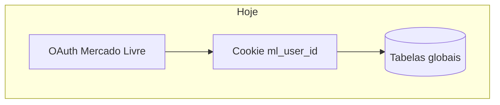
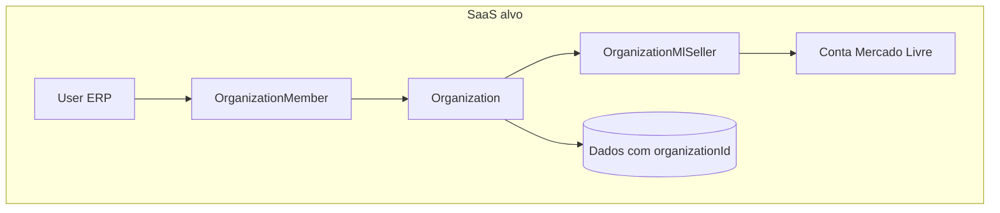

# Migração SaaS multi-tenant

Este documento descreve o estado **single-tenant** atual do ERP, o modelo **SaaS** alvo (organização + usuários ERP + vínculo Mercado Livre) e o que precisa mudar. É um registro vivo: toda feature nova que toca dados, APIs ou auth deve ganhar uma entrada na seção [Registro de features](#registro-de-features).

Modelo de dados proposto: [tenant-data-model.md](tenant-data-model.md).  
Template para novas entradas: [feature-saas-impact.md](../templates/feature-saas-impact.md).

---

## Resumo executivo

Hoje o sistema é **um deployment = uma empresa**. Login é OAuth do Mercado Livre; a sessão identifica o seller ML (`ml_user_id`), não um usuário ERP. A maior parte dos dados (produtos, DRE, listings, config fiscal) vive em tabelas **globais** sem `organizationId`.

Para vender como SaaS, o alvo é:

- **Organization** = cliente que paga pelo ERP
- **User** = pessoas da equipe do cliente (com papéis)
- **OrganizationMlSeller** = contas ML conectadas à org
- **Todas** as queries de negócio filtradas por `organizationId`

Estratégia: **um banco, multi-tenant por linha** (row-level), não um deployment por cliente.

---

## Estado atual

### Autenticação

| Aspecto | Hoje |
|---------|------|
| Login | Apenas OAuth ML (`/api/auth/mercadolibre/*`) |
| Sessão | Cookies `ml_access_token`, `ml_user_id`, etc. — `src/lib/mercadolibre/session.ts` |
| Proteção de rotas | Inline em ~25 API routes + `dashboard/layout.tsx`; sem `middleware.ts` |
| Modelo User/Org | **Não existe** no Prisma |

### Escopo parcial por seller ML

Algumas tabelas já usam `sellerId` / `mlUserId`:

| Modelo | Escopo |
|--------|--------|
| `TaxReportMonthSnapshot` | `@@unique([sellerId, year, month])` |
| `MlSellerCredentials` | PK `mlUserId` |

O restante do app **não** isola dados entre sellers: dois logins ML no mesmo DB veriam o mesmo catálogo de produtos e o mesmo DRE.

### Bloqueadores críticos

Todos resolvidos em 2026-08-21 (ver plano de implementação), exceto o último:

| Área | Problema | Status |
|------|----------|--------|
| Config fiscal | Singleton `CompanyTaxSettings.id = "default"` | ✅ uma linha por org, `@@unique([organizationId])` |
| Produtos | PK global `sku` | ✅ PK sintética + `@@unique([organizationId, sku])` |
| DRE | `@@unique([year, month])` — um snapshot/mês para todo o DB | ✅ `@@unique([organizationId, year, month])` |
| Listings / estoque | Sem `organizationId` | ✅ escopado, `organizationId` `NOT NULL` (Fase 7, 2026-08-21) |
| Cron catálogo | Um seller (`CRON_ML_USER_ID` ou primeiro credential) | ✅ redesenhado — fan-out por org pagante, lote rotativo (ver Fase 6) |
| App ML | Credenciais globais no `.env` | ⬜ ainda global — 1 app ML compartilhado por todos os tenants; risco de rate limit conhecido, ver [Rate limit do app ML compartilhado](#rate-limit-do-app-ml-compartilhado) |

### Rate limit do app ML compartilhado

Investigado em 2026-08-21 (pesquisa na [doc oficial de rate limit da Mercado Livre](https://developers.mercadolibre.com.ar/es_ar/rate-limit-error-429), FAQ "¿El rate limit se aplica por IP, por Client ID o por usuario?"):

- **Confirmado pela doc oficial:** o controle principal é **por Client ID (aplicação)**, não por seller/token — todos os tenants compartilham a mesma cota de `MERCADOLIBRE_CLIENT_ID` (`src/lib/mercadolibre/config.ts`). Um tenant com uso pesado (sync de catálogo grande, burst de chamadas) pode throttlar os outros — noisy-neighbor real, não teórico.
- **Não há número público de cota** — a ML não documenta um valor único (números como "1500 req/min" que aparecem em blogs de terceiros não vieram de fonte oficial nesta pesquisa e não devem ser usados como referência).
- **Caminho sancionado pra crescer:** a própria doc recomenda monitorar consumo por Client ID e solicitar aumento de cota ("equipe de integrações comerciais") com evidência de uso legítimo — é assim que integradores maiores (Bling, Tiny, Olist, etc.) operam, via "Developer Partner Program" da ML.
- **Ainda não sabemos** se a cota atual aguenta a escala alvo (~50 sellers) — não dá pra saber sem medir. Próximos passos, quando isso virar prioridade:
  1. Logar os headers de rate limit reais das respostas da API em `src/lib/mercadolibre/api.ts` pra ter o teto real do nosso `client_id` (não um número de blog).
  2. Com o dado em mãos, projetar a carga em 50 sellers e comparar com o headroom observado.
  3. Se estiver no limite, solicitar aumento de cota à ML antes de considerar qualquer redesenho de arquitetura (app por tenant é o plano B, só se a ML negar/limitar o aumento).
- **Decisão consciente:** não vamos mexer nisso agora — mantido como item de atenção, não bloqueador, enquanto a base de tenants for pequena.

Quando volume ou receita justificarem mudar cron, cota ML, billing ou isolamento: [saas-scale-triggers.md](saas-scale-triggers.md).

---

## Modelo alvo

Detalhes dos modelos: [tenant-data-model.md](tenant-data-model.md).

---

## Classificação das tabelas Prisma (2026-08-21, atualizado na Fase 7)

| Classificação | Modelos |
|---------------|---------|
| **Referência global** (compartilhável, nunca por org) | `CbsIbsVigencia`, `TaxpayerVerificationCache`, `FlexDistanceTier` |
| **Global por padrão, override opcional por org** (schema pronto, sem UI ainda) | `IcmsInternalRate` |
| **Por tenant — `organizationId` `NOT NULL`, todas as queries escopadas** | `Listing`, `WarehouseStock`, `ReplenishmentCycle`, `CatalogCompetitionSnapshot`, `StockAttentionAcknowledgement`, `DreCostItem`, `DreCostMonthValue`, `CatalogCompetitionPollRun`, `Kit`, `FullShipment`, `TaxFixedCostItem`, `TaxFixedCostMonthValue`, `TaxFixedCostMonthExclusion`, `Product`, `CompanyTaxSettings`, `KitItem`, `ProductSkuAlias`, `DreProductCostLeveling`, `DreMonthSnapshot` |
| **Parcial ML** (seller como proxy — `sellerId` já é um limite de tenant válido, 1 seller : 1 org; `organizationId` também `NOT NULL` desde a Fase 7, mas a chave de negócio continua sendo `sellerId`) | `TaxReportMonthSnapshot`, `RevenueSimulation` |
| **Storage de token, keyed por `mlUserId`** (não é dado de tenant) | `MlSellerCredentials` |

Guard-rail ativo (`src/lib/db-tenant-guard.ts`) pra linha "Por tenant" acima (`TENANT_SCOPED_MODELS`) — lança erro em dev/CI/prod se uma query em lote (`findMany`/`updateMany`/`deleteMany`/`count`/`aggregate`/`groupBy`) não tiver `organizationId` no `where`. `TaxReportMonthSnapshot`/`RevenueSimulation` ficam de fora de propósito (ver comentário em `db-tenant-guard.ts`).

---

## Mapa de mudanças por camada

### 1. Schema

- Novos modelos: `Organization`, `User`, `OrganizationMember`, `OrganizationMlSeller`
- `organizationId` em todas as tabelas de negócio
- Ajuste de uniques: `(organizationId, sku)`, `(organizationId, year, month)` no DRE, etc.
- Backfill: org `default` para dados existentes

### 2. Auth e sessão

- **Decidido (2026-08-21):** login continua sendo só OAuth do Mercado Livre — não haverá email/senha nem SSO nesta fase. `mlUserId` é a identidade de login; `Organization`/`User`/`OrganizationMember` existem no schema (multiusuário pronto para o futuro), mas hoje só o dono (1 `User` por org) é criado, automaticamente, no primeiro login OAuth.
- `requireOrganization(session)` centralizado — resolve `organizationId` a partir do `mlUserId` da sessão via `OrganizationMlSeller`
- Sessão com `userId` (ML) + `organizationId` resolvido a cada request (sem cache em cookie — ver plano de migração)

### 3. Libs / loaders

| Módulo | Arquivos principais |
|--------|---------------------|
| Produtos | `src/lib/product-data.ts` |
| DRE | `src/lib/dre-month-data.ts`, `src/lib/dre-year-data.ts` |
| Relatório tributário | `src/lib/tax-report/tax-config-data.ts`, `src/lib/tax-report/service/generate-monthly-report.ts` |
| Compras / estoque | `src/lib/dashboard-purchase-data.ts`, `src/lib/replenishment-cycle-data.ts` |
| Catálogo | `src/lib/catalog-competition-poll.ts` |
| Avaliação financeira | `src/lib/financial-evaluation-data.ts` |

### 4. API routes (sem escopo hoje — prioridade alta)

- `src/app/api/products/*`
- `src/app/api/dre/*`
- `src/app/api/company-tax-settings/route.ts`
- `src/app/api/tax-config/route.ts`
- `src/app/api/reports/catalog-competition/*`
- Webhook: `src/app/api/ml/notifications/catalog-competition/route.ts`
- Cron: `src/app/api/cron/catalog-competition/route.ts`

### 5. Frontend

- Contexto de organização ativa (header / seletor)
- URLs: org na sessão (v1) ou `/org/[slug]/...` (v2)

### 6. Infra

- Um deployment + PostgreSQL multi-tenant
- `ENCRYPTION_KEY` global; tokens ML por seller (ok)
- **Decidido (2026-08-21):** pagamento é controlado manualmente por enquanto — `Organization.status` (`trialing | active | past_due | canceled`) trocado à mão (rota interna ou Prisma Studio). Gateway real (Stripe/Mercado Pago) e planos/limites — fase posterior; o campo já é desenhado para um webhook de gateway escrever nele sem nova migration

---

## Roadmap de fases

| Fase | Escopo | Status |
|------|--------|--------|
| **0 — Doc** | Este documento + processo em AGENTS.md | ✅ |
| **1 — Contexto** | Modelo `Organization` + helper `requireOrganization` | ✅ |
| **2 — Schema** | `organizationId` + backfill | ✅ (chave composta nos modelos que precisavam; `NOT NULL` nos demais concluído na Fase 7) |
| **3 — APIs** | Escopar rotas e libs existentes | ✅ completo — zero rota ainda em `requireAuth()` |
| **4 — Auth ERP** | ~~Users, convites, papéis~~ — **simplificado (2026-08-21):** schema `User`/`OrganizationMember` pronto, mas só auto-provisionamento do dono no login ML; convite de 2º usuário fica pra depois | ✅ (versão simplificada) |
| **5 — Produto SaaS** | Onboarding, gate de pagamento manual agora; billing automático (gateway) depois | 🟡 gate de pagamento manual funcionando; onboarding/billing automático seguem fora de escopo |
| **6 — Cron multi-tenant** *(adicionada em 2026-08-21)* | Redesenho do cron de catálogo pra não escalar linearmente com tenants | ✅ |
| **7 — Hardening** *(adicionada em 2026-08-21)* | Apertar `NOT NULL` nos modelos restantes após backfill em produção | ✅ (2026-08-21) — migration `20260821213929_saas_tenant_hardening_not_null`, backfill defensivo idempotente incluso; achou e corrigiu 2 write paths reais sem `organizationId` (`POST /api/insights/revenue-simulations`, `saveTaxReportSnapshot`) |

Plano de execução detalhado (arquivos e código concretos): ver plano de implementação de 2026-08-21.

---

## Registro de features

Entradas ordenadas da mais recente para a mais antiga. Use o [template](../templates/feature-saas-impact.md).

### Remoção da Simulação de filial — 2026-08-22

- **Tabelas novas/alteradas:** nenhuma
- **Precisa `organizationId`?** não — feature removida (página, menu, API e motor de cálculo)
- **APIs afetadas:** `GET/POST /api/tax-report/branch-simulation` deixam de existir
- **Assume singleton?** não
- **Cron/background:** nenhum
- **Dados globais vs por org:** n/a
- **Código já tenant-ready?** n/a
- **Ação futura na migração:** nenhuma

### Suporte a Simples Nacional (v1 — regime + campos de produto + hub de Configurações) — 2026-08-22

- **Tabelas novas/alteradas:** `company_tax_settings` ganha `simples_aliquota_efetiva_percent` (nullable, migration `20260822215916_company_tax_settings_simples_nacional`); `products` inalterada (sem migration — `purchase_icms_percent`/`sale_icms_percent` continuam `NOT NULL`; campo fiscal omitido no PATCH preserva o valor já gravado em vez de exigir 0)
- **Precisa `organizationId`?** sim — `company_tax_settings` já é `organizationId`-scoped (Fase 7 concluída); o campo novo nasce tenant-ready sem esforço extra
- **APIs afetadas:** `PATCH /api/tax-config` (campo novo, ainda `.partial()`), `GET/POST /api/products` e `GET/PATCH /api/products/[sku]` (campos fiscais de Lucro Real viram opcionais no payload; response ganha `taxRegime`/`simplesAliquotaEfetivaPercent`)
- **Assume singleton?** não
- **Cron/background:** nenhum
- **Dados globais vs por org:** tudo por org (config fiscal, produtos)
- **Código já tenant-ready?** sim — nenhum código novo introduz singleton
- **Ação futura na migração:** v2 (tabelas oficiais de Simples — Anexo/Faixa RBT12/Fator R — e redução parcial de monofásico, LC 123/2006 art. 18 §4-A) fica para depois, sem dívida de schema deixada por este v1

### Landing de conversão (pré-login) — 2026-08-22

- **Tabelas novas/alteradas:** nenhuma
- **Precisa `organizationId`?** não — página pública, zero query Prisma
- **APIs afetadas:** nenhuma; CTA continua `GET /api/auth/mercadolibre/signin`
- **Assume singleton?** não
- **Cron/background:** nenhum
- **Dados globais vs por org:** demos com dados fictícios; trial ao conectar (`Organization.status = trialing`) inalterado
- **Código já tenant-ready?** sim — não toca dado de tenant
- **Ação futura na migração:** tabela de preço / gateway quando billing deixar de ser manual

### Fase 7 — Hardening `organizationId NOT NULL` — 2026-08-21

- **Tabelas novas/alteradas:** `organization_id` virou `NOT NULL` em 15 tabelas (`listings`, `kits`, `warehouse_stock`, `replenishment_cycles`, `catalog_competition_snapshots`, `catalog_competition_poll_runs`, `stock_attention_acknowledgements`, `full_shipments`, `dre_cost_items`, `dre_cost_month_values`, `tax_fixed_cost_items`, `tax_fixed_cost_month_values`, `tax_fixed_cost_month_exclusions`, `tax_report_month_snapshots`, `revenue_simulations`) — migration `20260821213929_saas_tenant_hardening_not_null`, com backfill defensivo idempotente embutido (mesmo padrão das migrations da Fase 2)
- **Precisa `organizationId`?** já tinha a coluna (Fase 2); esta entrada só remove a nulabilidade
- **APIs afetadas:** nenhuma rota nova; o typecheck pós-migration revelou 2 write paths reais sem `organizationId` que foram corrigidos: `POST /api/insights/revenue-simulations` (`prisma.revenueSimulation.create`) e `saveTaxReportSnapshot` (`src/lib/tax-report/service/generate-monthly-report.ts`, chamada por `POST /api/reports/monthly-tax`) — ambos já resolviam `organizationId` via `requireOrganization()` mas não estavam gravando na tabela
- **Assume singleton?** não
- **Cron/background:** nenhum
- **Dados globais vs por org:** nenhuma mudança de comportamento — só remove a lacuna de integridade que restava no schema
- **Código já tenant-ready?** sim — era o objetivo desta fase
- **Ação futura na migração:** nenhuma — script de backfill da org default já rodou em prod e foi removido; `scripts/seed-catalog-report-demo.ts` resolve `organizationId` da primeira `Organization` do banco

### Remoção do alerta push de catálogo — 2026-08-20

- **Tabelas novas/alteradas:** `push_subscriptions` removida (migration `20260820120000_drop_push_subscriptions`); `CatalogCompetitionSnapshot` inalterada
- **Precisa `organizationId`?** não aplicável — feature removida
- **APIs afetadas:** `DELETE /api/push/subscriptions/*` (rota removida); webhook `POST /api/ml/notifications/catalog-competition` mantido, mas perdeu o envio de Web Push — só grava snapshot/atualiza `Listing`
- **Assume singleton?** não aplicável
- **Cron/background:** nenhum
- **Dados globais vs por org:** nenhum impacto — a página `dashboard/catalog-report` (relatório) continua intacta, lendo `CatalogCompetitionSnapshot`
- **Código já tenant-ready?** não aplicável
- **Ação futura na migração:** nenhuma — remove um bloqueador a menos da lista (modelo `PushSubscription` não existe mais); se notificações voltarem no futuro, desenhar já com `organizationId`

### Badge "Fora do PMA" na lista de Lucratividade — 2026-08-12

- **Tabelas novas/alteradas:** nenhuma (reaproveita `Product.pmaPrice`, já existente)
- **Precisa `organizationId`?** parcial — hoje a consulta de PMA por SKU é global (`prisma.product.findMany`), sem filtro de org; segue o padrão já usado no restante de `financial-evaluation-data.ts`
- **APIs afetadas:** `GET /api/financial-evaluation` (stream e não-stream); `FinancialEvaluationRow` ganhou o campo `pmaPrice: number | null`
- **Assume singleton?** não
- **Cron/background:** nenhum
- **Dados globais vs por org:** `Product.pmaPrice` é global hoje, mesma limitação de todo o cadastro de produtos
- **Código já tenant-ready?** não — segue o padrão existente do módulo (sem `organizationId`); ao escopar `Product` por org, a query de `pmaBySku` em `loadFinancialEvaluationRows`/`loadFinancialEvaluationRowsForPeriod` deve ganhar o mesmo filtro
- **Ação futura na migração:** ao adicionar `organizationId` em `Product`, propagar para as duas queries de `pmaBySku` em `src/lib/financial-evaluation-data.ts`

### DRE — nivelamento de custo de produto por período — 2026-08-11

- **Tabelas novas/alteradas:** nova `dre_product_cost_levelings` (`DreProductCostLeveling`: SKU FK → `Product`, intervalo inclusivo de meses, campos NF/ST/IPI); `Product` ganha relação `dreCostLevelings`
- **Precisa `organizationId`?** **sim** — hoje global por deployment (mesmo padrão de `DreCostItem` / `Product`)
- **APIs afetadas:** novas `GET/POST /api/dre/product-cost-leveling` e `PATCH/DELETE /api/dre/product-cost-leveling/[id]`; sync DRE (`computeErpCostsFromOrderLines`) aplica override de `pricingCost` só no cálculo de `productCostErp` / breakdown
- **Assume singleton?** **sim** — sem `organizationId`; um conjunto de nivelamentos por deployment
- **Cron/background:** nenhum
- **Dados globais vs por org:** nivelamentos e snapshot DRE únicos do deployment; **não** altera Meus produtos, Lucratividade, Estoque nem relatório tributário
- **Código já tenant-ready?** parcial — CRUD/`loadLevelingPricingBySkuForMonth`/`applyLevelingPricingToMap` são funções explícitas sem singleton; falta escopo por `organizationId`
- **Ação futura na migração:** adicionar `organizationId` em `DreProductCostLeveling` junto com `Product`/`DreMonthSnapshot`; filtrar queries e validar SKU da mesma org

### Cadastro manual de kits do Mercado Livre (anúncios sem SKU) — 2026-08-08

- **Tabelas novas/alteradas:** novas tabelas `kits` (`Kit`, PK `mlItemId`) e `kit_items` (`KitItem`, PK composta `[kitId, sku]`, FK para `Kit.mlItemId` e `Product.sku`); `Product` ganha relação `kitItems`
- **Precisa `organizationId`?** sim, no futuro — hoje `Kit`/`KitItem` são globais por deployment (chave é o `mlItemId`/`sku`, sem escopo de seller), mesmo padrão de `Product`
- **APIs afetadas:** novas `GET/POST /api/kits` e `PUT/DELETE /api/kits/[id]`; `loadFinancialEvaluationRows(ForPeriod)` (Lucratividade) e `computeErpCostsFromOrderLines` (DRE mensal) passam a consultar `Kit`/`KitItem` para decompor custo/imposto de anúncios-kit; Estoque, Potencial de Faturamento, Compras e Reposição passam a filtrar (`isKitItem`) esses anúncios da listagem, sem tocar no banco
- **Assume singleton?** não
- **Cron/background:** nenhum
- **Dados globais vs por org:** `Kit`/`KitItem` são globais, mesmo nível de tenant-readiness que `Product` hoje
- **Código já tenant-ready?** parcial — `loadKitsByMlItemId`/`resolveKitPricing` (`src/lib/kit-data.ts`) recebem tudo via parâmetros explícitos, sem singleton; ainda não escopam por `organizationId` porque nada no módulo de produtos escopa hoje
- **Ação futura na migração:** ao introduzir `organizationId`, adicionar a coluna em `Kit`/`KitItem` junto com `Product`, no mesmo passo de migração

### Novas regras de crédito PIS/COFINS + créditos Meli/ADS + produto importado — 2026-08-06

- **Tabelas novas/alteradas:** nenhuma nova tabela; `Product.isImported`/`Product.importContentPercent` já existiam no schema (só ganharam caminho de escrita via `/api/products`); `tax_report_month_snapshots.payload` (JSON) ganha novos campos (`saleFee`, `ipiPercent` em `TransacaoVenda`, `creditoOutrasDespesas` em `DetalhamentoTributario`) — schema Prisma inalterado
- **Precisa `organizationId`?** sim, no futuro — hoje tudo continua escopado por `sellerId`/`accessToken` da sessão ML, mesmo padrão do restante do relatório tributário e do cadastro de produtos
- **APIs afetadas:** `POST /api/products` e `PATCH /api/products/[sku]` passam a aceitar `isImported`/`importContentPercent`; geração do relatório mensal (`generateMonthlyTaxReport`) passa a chamar `fetchPadsAdvertiserId`/`fetchProductAdsMetricsByItem` (API de Ads do Mercado Livre) a cada geração, sem cache — aumenta o número de chamadas externas por relatório
- **Assume singleton?** não
- **Cron/background:** nenhum novo — a busca de métricas de Ads é síncrona dentro da geração do relatório (decisão consciente: dado "ao vivo" a cada geração, sem cache)
- **Dados globais vs por org:** `Product.isImported`/`importContentPercent`/`ipiPercent` continuam globais (mesmo padrão de `unitCostNf`/`purchaseIcmsPercent`); o crédito de Ads depende do `accessToken`/seller autenticado no momento da geração do relatório
- **Código já tenant-ready?** parcial — as funções novas (`calcularCreditoMeliFee`, `calcularCreditoAds`, `calcularCreditoOutrasDespesas`) recebem todos os dados via parâmetros explícitos, sem singleton nem sessão/DB lidos diretamente; seguem o mesmo nível de tenant-readiness do restante do módulo `tax-report` (escopado por `sellerId`, ainda não por `organizationId`)
- **Ação futura na migração:** ao introduzir `organizationId`, trocar `accessToken`/`sellerId` avulsos por contexto de organização já resolvido, igual ao restante do módulo tributário e do cadastro de produtos

### Custo de precificação + Imposto na tela de produtos vindos do relatório tributário — 2026-07-29

- **Tabelas novas/alteradas:** nenhuma — passou a ler `tax_report_month_snapshots` (já existente) a partir de `GET /api/products`
- **Precisa `organizationId`?** sim, no futuro — hoje usa `sellerId` (userId da sessão ML), mesmo padrão de `loadLatestTaxReportSnapshot`
- **APIs afetadas:** `GET /api/products` (agora chama `loadProductTaxFromLatestReport(sellerId)` e retorna `taxReportGeneratedAt`)
- **Assume singleton?** não — usa o snapshot mais recente por `sellerId` (`findFirst orderBy year/month desc`), sem `id: "default"`
- **Cron/background:** nenhum
- **Dados globais vs por org:** `Product` (custo/IPI/ICMS-ST) continua global; o percentual de imposto agora vem por `sellerId`, via `src/lib/product-tax-from-report.ts`
- **Código já tenant-ready?** parcial — `loadProductTaxFromLatestReport(sellerId, ...)` já recebe o id como parâmetro (fácil trocar por `organizationId`); `Product`/`buildProductView` continuam globais e precisarão de escopo por org na migração
- **Ação futura na migração:** escopar `Product` por `organizationId` e trocar `sellerId` por `organizationId` em `loadLatestTaxReportSnapshot`/`loadProductTaxFromLatestReport`

### Simulações salvas — potencial de faturamento / capital de giro — 2026-07-22

- **Tabelas novas/alteradas:** `revenue_simulations` (nova) — `id`, `seller_id`, `name`, `payload` (JSON com overrides/excluídos/período/parcelas), timestamps
- **Precisa `organizationId`?** sim, no futuro — hoje escopado por `seller_id` (ml_user_id da sessão), seguindo o mesmo padrão de `tax_report_month_snapshots`
- **APIs afetadas:** novas — `GET/POST /api/insights/revenue-simulations`, `GET/PATCH/DELETE /api/insights/revenue-simulations/[id]`
- **Assume singleton?** não — cada simulação é uma linha própria por `seller_id`, sem `id: "default"`
- **Cron/background:** nenhum
- **Dados globais vs por org:** todas as queries já filtram por `sellerId` (`findMany`/`findFirst where sellerId`)
- **Código já tenant-ready?** parcial — troca de `sellerId` por `organizationId` é direta (mesmo padrão de coluna e filtro); a lógica de simulação em si (overrides/excluídos/período/parcelas) não depende de tenant
- **Ação futura na migração:** renomear/adicionar `organizationId` na tabela e nos filtros das rotas quando o login de usuário ERP existir

### Otimização geração relatório — 2026-06-18

- **Tabelas novas/alteradas:** nenhuma (mesmo schema JSON, formato enxuto)
- **Precisa `organizationId`?** não
- **APIs afetadas:** `POST /api/reports/monthly-tax` (SSE `complete` sem payload; `maxDuration=300`)
- **Assume singleton?** produtos/settings globais — batch `loadCustoBySkuMap` escopado ao tenant futuro
- **Cron/background:** nenhum
- **Dados globais vs por org:** `products` + `company_tax_settings` em 2 queries por geração
- **Código já tenant-ready?** parcial — batch aceita lista de SKUs; escopar `findMany` por org na migração
- **Ação futura na migração:** `loadCustoBySkuMap(organizationId, skus)`; job em background se volume exceder 300s

### Busca aberta — relatório tributário — 2026-06-18

- **Tabelas novas/alteradas:** nenhuma
- **Precisa `organizationId`?** não (filtro client-side em dados já carregados)
- **APIs afetadas:** nenhuma
- **Assume singleton?** não; filtra `porSku` e transações do snapshot em memória
- **Cron/background:** nenhum
- **Dados globais vs por org:** lista SKUs do snapshot do seller logado
- **Código já tenant-ready?** parcial — ok para seller scope; org scope exigirá snapshot por org
- **Ação futura na migração:** busca continua client-side; garantir que API retorne só dados da org ativa

### Export Excel vendas SKU — 2026-06-18

- **Tabelas novas/alteradas:** nenhuma (export client-side via `xlsx`)
- **Precisa `organizationId`?** não diretamente
- **APIs afetadas:** usa `GET /api/reports/monthly-tax` existente
- **Assume singleton?** não; custos no relatório vêm de `Product` global
- **Cron/background:** nenhum
- **Dados globais vs por org:** exporta vendas filtradas do snapshot do seller logado
- **Código já tenant-ready?** parcial
- **Ação futura na migração:** escopar produtos e geração de snapshot por `organizationId`

### Relatório tributário mensal — baseline

- **Tabelas:** `tax_report_month_snapshots`, `company_tax_settings`, `products`, `icms_internal_rates`, `cbs_ibs_vigencia`
- **Precisa `organizationId`?** **parcial** — snapshot tem `sellerId`; configs e produtos são globais
- **APIs:** `/api/reports/monthly-tax`, `/api/tax-config`, `/api/company-tax-settings`
- **Assume singleton?** **sim** — `CompanyTaxSettings.id = "default"`, `Product.sku` global
- **Cron/background:** geração sob demanda (SSE), não cron
- **Ação futura:** `@@unique([organizationId, sellerId, year, month])`; configs e CMV por org

### DRE — baseline

- **Tabelas:** `dre_month_snapshots`, `dre_cost_items`, `dre_cost_month_values`
- **Precisa `organizationId`?** **sim** — crítico
- **APIs:** `/api/dre/*`
- **Assume singleton?** **sim** — `@@unique([year, month])` global
- **Cron/background:** sync manual; usa seller da sessão mas persiste global
- **Ação futura:** unique `(organizationId, year, month)`; custos fixos por org

### DRE — linhas editáveis (PATCH) — 2026-08-11

- **Tabelas novas/alteradas:** nenhuma (reusa `dre_month_snapshots.payload` JSON)
- **Precisa `organizationId`?** **sim** — mesmo snapshot global por `(year, month)`
- **APIs afetadas:** `PATCH /api/dre/lines` (cria/atualiza uma linha do payload); sync `POST /api/dre/sync` inalterado (overwrite com confirmação no client)
- **Assume singleton?** **sim** — `@@unique([year, month])`
- **Cron/background:** nenhum
- **Dados globais vs por org:** edição e sync gravam no snapshot único do deployment
- **Código já tenant-ready?** **não** — `patchDreMonthLine(year, month, …)` sem `organizationId`
- **Ação futura na migração:** escopar `patchDreMonthLine` / sync / cost-values por `organizationId`

### DRE — Minha Página e Comissão Afiliados (fatura ML) — 2026-08-11

- **Tabelas novas/alteradas:** nenhuma (campos novos no JSON de `dre_month_snapshots.payload`: `minhaPaginaMl`, `affiliateFeeMl`)
- **Precisa `organizationId`?** **sim** — mesmo snapshot DRE global
- **APIs afetadas:** sync `POST /api/dre/sync` (mapeia `CESM`/`CVAF` da fatura); `PATCH /api/dre/lines` (linhas editáveis)
- **Assume singleton?** **sim** — `@@unique([year, month])`
- **Cron/background:** nenhum
- **Dados globais vs por org:** valores vêm da fatura do seller ML da sessão, mas persistem no snapshot único
- **Código já tenant-ready?** **não** — classificador/sync sem `organizationId`
- **Ação futura na migração:** escopar sync e snapshot por org; classificador permanece puro

### DRE — edição manual marcada, devoluções parciais, export CSV — 2026-08-11

- **Tabelas novas/alteradas:** nenhuma (campos JSON no payload: `syncedLineBaseline`, `manuallyEditedLineKeys`; linha UI `partialReturnsMl`)
- **Precisa `organizationId`?** **sim** — mesmo snapshot DRE global
- **APIs afetadas:** `PATCH /api/dre/lines` (`action: set|restore`); sync grava baseline; export CSV é client-side
- **Assume singleton?** **sim** — `@@unique([year, month])`
- **Cron/background:** nenhum
- **Dados globais vs por org:** edições/restore no snapshot único do deployment
- **Código já tenant-ready?** **não** — `patchDreMonthLine` / `restoreDreMonthLine` sem `organizationId`
- **Ação futura na migração:** escopar patch/restore/sync por `organizationId`

### DRE — sync com preservação seletiva de ajustes — 2026-08-11

- **Tabelas novas/alteradas:** nenhuma (reusa payload JSON)
- **Precisa `organizationId`?** **sim** — snapshot DRE global
- **APIs afetadas:** `POST /api/dre/sync` (`preserveLineKeys?: DreEditableLineKey[]`)
- **Assume singleton?** **sim** — `@@unique([year, month])`
- **Cron/background:** nenhum
- **Dados globais vs por org:** sync e merge de overrides no snapshot único
- **Código já tenant-ready?** **não** — `persistDreMonthSnapshot` / sync sem `organizationId`
- **Ação futura na migração:** escopar sync/persist por `organizationId`

### DRE — custo recorrente vs só no mês — 2026-08-11

- **Tabelas novas/alteradas:** `dre_cost_items.recurring` (boolean, default true)
- **Precisa `organizationId`?** **sim** — itens de custo globais do deployment
- **APIs afetadas:** `POST/PATCH /api/dre/cost-items` (`recurring`); leitura efetiva em `resolveEffectiveFixedCostsForYear`
- **Assume singleton?** **sim** — sem `organizationId` em `DreCostItem`
- **Cron/background:** nenhum
- **Dados globais vs por org:** itens e valores mensais únicos do deployment
- **Código já tenant-ready?** **não** — create/update/load sem `organizationId`
- **Ação futura na migração:** escopar `DreCostItem` / `DreCostMonthValue` por `organizationId`

### DRE — merge billing summary vs details (estabilidade) — 2026-08-11

- **Tabelas novas/alteradas:** nenhuma
- **Precisa `organizationId`?** **sim** — snapshot DRE / fatura ML por seller (hoje single-tenant)
- **APIs afetadas:** sync DRE (`fetchMlBillingSummaryForMonth` / `mergeBillingLines`)
- **Assume singleton?** **sim**
- **Cron/background:** nenhum (sync manual/UI)
- **Dados globais vs por org:** totais de fatura no snapshot único
- **Código já tenant-ready?** **não**
- **Ação futura na migração:** escopar sync/billing por org + seller

### DRE — auto-import Full no sync — 2026-08-11

- **Tabelas novas/alteradas:** escreve `full_shipments` quando o mês ainda não tem import
- **Precisa `organizationId`?** **sim** — envios Full e snapshot DRE globais do deployment
- **APIs afetadas:** `POST /api/dre/sync` → `importFullCollectChargesFromBilling` (mesmo fluxo de `POST /api/full-shipments/import-ml`)
- **Assume singleton?** **sim** — `full_shipments` sem `organizationId`
- **Cron/background:** nenhum
- **Dados globais vs por org:** import Full e DRE no mesmo banco single-tenant
- **Código já tenant-ready?** **não**
- **Ação futura na migração:** escopar `full_shipments` + sync DRE por `organizationId`

### DRE — tarifas especiais, devolução e fatura por mês civil — 2026-08-11

- **Tabelas novas/alteradas:** nenhuma (campos novos no JSON de `dre_month_snapshots.payload`: `returnFeeMl`, `specialFeesMl`)
- **Precisa `organizationId`?** **sim** — snapshot DRE / fatura ML por seller (hoje single-tenant)
- **APIs afetadas:** sync DRE (`classifyMlBillingEntry`, `aggregateBillingDetailsForCivilMonthOrders`, `buildDreMonthSnapshot`)
- **Assume singleton?** **sim** — `dre_month_snapshots` por `year_month`
- **Cron/background:** nenhum
- **Dados globais vs por org:** classificação de fatura e snapshot únicos do deployment
- **Código já tenant-ready?** **não**
- **Ação futura na migração:** escopar sync/billing e snapshot por `organizationId`

### Produtos e pricing — baseline

- **Tabelas:** `products`, `company_tax_settings`
- **Precisa `organizationId`?** **sim** — crítico
- **APIs:** `/api/products/*`, `/api/company-tax-settings`
- **Assume singleton?** **sim** — PK `sku`, settings `id: "default"`
- **Ação futura:** `@@unique([organizationId, sku])`; uma config fiscal por org

### Avaliação financeira — baseline

- **Tabelas:** lê ML em tempo real + `products` para custo/imposto
- **Precisa `organizationId`?** **sim** (produtos); ML já por seller da sessão
- **APIs:** `/api/financial-evaluation/*`
- **Ação futura:** `loadFinancialEvaluationRows(token, userId, { organizationId })`

### Lucratividade — ordenação e margem por período — 2026-07-13

- **Tabelas novas/alteradas:** nenhuma
- **Precisa `organizationId`?** parcial — custos vêm de `products` (hoje global); vendas/ads por seller ML da sessão
- **APIs afetadas:** `GET /api/financial-evaluation` (`from`/`to` opcionais → modo período)
- **Assume singleton?** não em vendas; custos ainda via `Product.sku` global
- **Cron/background:** nenhum
- **Dados globais vs por org:** preço médio e TACOS do período por seller; CMV/alíquota do cadastro atual
- **Código já tenant-ready?** parcial — passar `organizationId` em `loadProductsMapBySku` / loaders novos
- **Ação futura na migração:** `loadFinancialEvaluationRowsForPeriod(..., { organizationId })`; escopar produtos por org

### Compras e estoque — baseline

- **Tabelas:** `listings`, `warehouse_stock`, `replenishment_cycles`
- **Precisa `organizationId`?** **sim**
- **APIs:** páginas server + `/api/inventory/*`, `/api/replenishment-cycles/*`
- **Assume singleton?** **sim** — listings sem seller/org no DB
- **Ação futura:** `organizationId` em listings; join estoque por org

### Catálogo competição — baseline

- **Tabelas:** `listings`, `catalog_competition_snapshots`, `catalog_competition_poll_runs`
- **Precisa `organizationId`?** **sim**
- **Cron:** `CRON_ML_USER_ID` ou primeiro seller — single-tenant
- **Webhook:** resolve seller por `user_id`; sem org
- **Ação futura:** cron por org; webhook → `OrganizationMlSeller`

### Listing `mlStatus` (filtro pausados no catálogo) — 2026-07-16

- **Tabelas novas/alteradas:** `listings.ml_status` (String opcional)
- **Precisa `organizationId`?** **sim** — mesmo escopo de `listings` (hoje global)
- **APIs afetadas:** `GET /api/reports/catalog-competition`; poll/webhook/inventory upserts gravam `mlStatus`
- **Assume singleton?** **sim** — `listings` sem org/seller no DB
- **Cron/background:** poll de catálogo preenche o campo
- **Dados globais vs por org:** status ML do anúncio; no SaaS fica por org junto com listing
- **Código já tenant-ready?** não — falta `organizationId` em `listings`
- **Ação futura na migração:** filtrar listings por org; não criar singleton

### Home operacional (`/dashboard`) — 2026-07-21

- **Tabelas novas/alteradas:** nenhuma (lê `listings`, `replenishment_cycles`)
- **Precisa `organizationId`?** **sim** — counts de catálogo losing e cycles hoje globais
- **APIs afetadas:** nenhuma nova; promoções via `GET /api/dashboard/summary/promotions` existente
- **Assume singleton?** **sim** — listings/cycles sem org
- **Cron/background:** nenhum
- **Dados globais vs por org:** home resume dados do seller logado (promo ML) + DB global
- **Código já tenant-ready?** não — filtrar listings/cycles por org
- **Ação futura na migração:** escopar `loadOperationsSummaryFromDb` e query losing por `organizationId`

### Push notifications — baseline

- **Tabelas:** `push_subscriptions`
- **Precisa `organizationId`?** parcial — já por `mlUserId`
- **Ação futura:** validar que `mlUserId` pertence à org da sessão

### Configurações tributárias (UI) — baseline

- **Tabelas:** `company_tax_settings`, `icms_internal_rates`, `cbs_ibs_vigencia`
- **Precisa `organizationId`?** settings **sim**; CBS/IBS pode ficar global; ICMS override por org
- **APIs:** `/api/tax-config`, `/dashboard/configuracoes/tributario` (antigo `/dashboard/configuracoes-tributarias` agora redireciona)
- **Assume singleton?** não — Fase 7 já resolveu isso: uma linha por `organizationId`, `@@unique([organizationId])` (nota: esta entrada dizia "sim, id: default" até 2026-08-22; corrigido para refletir o schema atual)

---

## Boas práticas ao desenvolver agora

A migração de escopo (Fases 1-6) está feita — a partir de agora, isto não é mais preparação, é o padrão obrigatório:

1. **Nunca criar um novo singleton** (`id: "default"`, tabela de negócio sem `organizationId`)
2. **Toda função nova** em lib que toca modelo de negócio: `organizationId` é o primeiro parâmetro, **obrigatório** (não opcional)
3. **Toda rota de API nova**: usar `requireOrganization()` (não `requireAuth()`), documentar na seção Registro de features
4. **Toda query em lote nova** (`findMany`/`updateMany`/`deleteMany`/`count`/`aggregate`/`groupBy`) sobre modelo de negócio: incluir `organizationId` no `where` — o guard-rail (`src/lib/db-tenant-guard.ts`) lança erro em runtime se esquecer, mas é mais barato acertar de primeira. Se o modelo novo for tenant-scoped, adicionar seu nome em `TENANT_SCOPED_MODELS` assim que TODAS as queries dele já filtrarem por org.
5. **Testes**: usar `organizationId` de teste nas factories

---

## Fora de escopo (por enquanto)

- Gateway de pagamento real (Stripe/Mercado Pago), planos e limites — status hoje é manual
- Convite de segundo usuário por organização / login por email
- UI de seleção de organização (desnecessária enquanto login = 1 org por sessão)
- Override de `IcmsInternalRate` por org via UI (schema já suporta; sem tela ainda)
- Subdomínios por tenant (`cliente.app.com`)

Quando algum destes itens (ou o cron hora-a-hora para todos os orgs) virar prioridade: [saas-scale-triggers.md](saas-scale-triggers.md).
