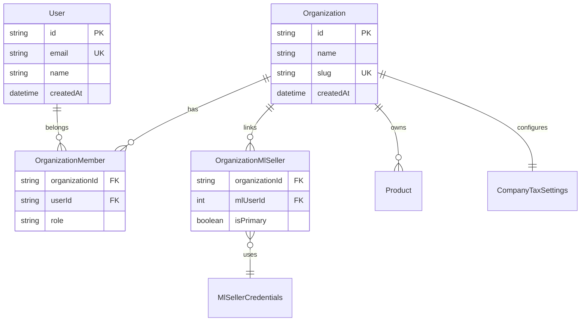

# Modelo de dados do tenant (proposta)

Documento de **design futuro**. Nenhum destes modelos existe no Prisma hoje. Serve como referência para a migração SaaS descrita em [saas-migration.md](saas-migration.md).

## Decisão de produto

- **Organization** = cliente SaaS (empresa que compra o ERP)
- **User** = pessoa que acessa o ERP (vários por organização, com papéis)
- **OrganizationMlSeller** = conta Mercado Livre vinculada à organização (1 org : N sellers ML)

O login do ERP **não** será apenas OAuth do ML. O ML permanece como integração para buscar pedidos, anúncios e billing.

## Diagrama de relacionamento



## Modelos propostos (Prisma)

### Organization

```prisma
model Organization {
  id        String   @id @default(cuid())
  name      String
  slug      String   @unique
  createdAt DateTime @default(now()) @map("created_at")
  updatedAt DateTime @updatedAt @map("updated_at")

  members     OrganizationMember[]
  mlSellers   OrganizationMlSeller[]
  // relations to Product, Listing, DreMonthSnapshot, etc.

  @@map("organizations")
}
```

### User

```prisma
model User {
  id        String   @id @default(cuid())
  email     String   @unique
  name      String?
  createdAt DateTime @default(now()) @map("created_at")
  updatedAt DateTime @updatedAt @map("updated_at")

  memberships OrganizationMember[]

  @@map("users")
}
```

### OrganizationMember

```prisma
enum OrganizationRole {
  owner
  admin
  member
}

model OrganizationMember {
  organizationId String           @map("organization_id")
  userId         String           @map("user_id")
  role           OrganizationRole @default(member)
  createdAt      DateTime         @default(now()) @map("created_at")

  organization Organization @relation(fields: [organizationId], references: [id], onDelete: Cascade)
  user         User         @relation(fields: [userId], references: [id], onDelete: Cascade)

  @@id([organizationId, userId])
  @@map("organization_members")
}
```

### OrganizationMlSeller

```prisma
model OrganizationMlSeller {
  organizationId String  @map("organization_id")
  mlUserId       Int     @map("ml_user_id")
  isPrimary      Boolean @default(false) @map("is_primary")
  linkedAt       DateTime @default(now()) @map("linked_at")

  organization Organization @relation(fields: [organizationId], references: [id], onDelete: Cascade)

  @@id([organizationId, mlUserId])
  @@map("organization_ml_sellers")
}
```

`MlSellerCredentials` permanece keyed por `mlUserId`; a junction define **qual org** pode usar aquele seller.

## Sessão autenticada (alvo)

Campos mínimos na sessão (cookie ou JWT):

| Campo | Descrição |
|-------|-----------|
| `userId` | Usuário ERP logado |
| `organizationId` | Organização ativa |
| `mlUserId` | Seller ML ativo (opcional se org tem vários) |

Helper alvo: `requireOrganization(session)` — retorna `organizationId` ou 401/403.

## Escopo de dados existentes

Tabelas que ganham `organizationId` (FK obrigatório após backfill):

| Tabela atual | Mudança de unique |
|--------------|-------------------|
| `products` | `@@unique([organizationId, sku])` |
| `company_tax_settings` | uma linha por org (remover `id: "default"`) |
| `dre_month_snapshots` | `@@unique([organizationId, year, month])` |
| `listings` | `organizationId` + índice (PK `ml_item_id` pode permanecer) |
| `warehouse_stock` | via listing ou `organizationId` |
| `dre_cost_items` | `organizationId` |
| `tax_report_month_snapshots` | considerar `@@unique([organizationId, sellerId, year, month])` |

Tabelas que podem permanecer **globais** (referência nacional):

- `cbs_ibs_vigencia`
- `taxpayer_verification_cache`
- `icms_internal_rates` (seed) + futura tabela de override por org, se necessário

## Backfill da instância atual

Na primeira migração multi-tenant:

1. Criar `Organization` com `slug: "default"` (empresa atual)
2. Atribuir `organizationId` a todas as linhas de negócio existentes
3. Mapear o seller ML atual em `OrganizationMlSeller`
4. Quando existir auth ERP: criar `User` owner e `OrganizationMember`

## Decisões em aberto

- Formato de login ERP (email/senha, magic link, SSO)
- URL com prefixo `/org/[slug]/...` vs org implícita na sessão
- Billing e limites por plano (fase posterior)
- Um seller ML pode pertencer a mais de uma org? (recomendação: **não**)
