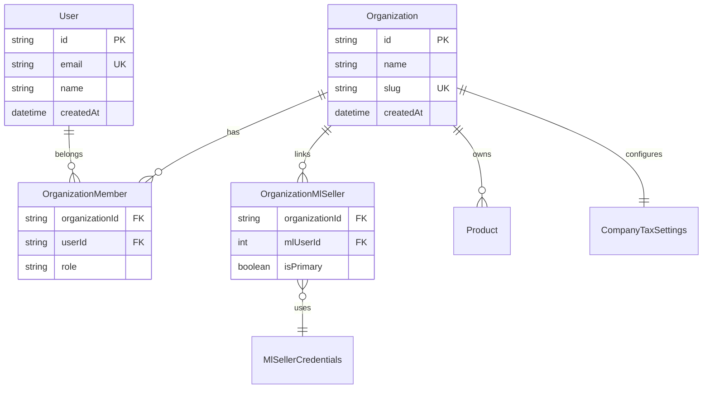

# Modelo de dados do tenant (proposta)

Documento de **design futuro**. Nenhum destes modelos existe no Prisma hoje. Serve como referência para a migração SaaS descrita em [saas-migration.md](saas-migration.md).

## Decisão de produto

- **Organization** = cliente SaaS (empresa que compra o ERP)
- **User** = pessoa que acessa o ERP (vários por organização, com papéis)
- **OrganizationMlSeller** = conta Mercado Livre vinculada à organização (1 org : N sellers ML)

**Decidido (2026-08-21):** o login do ERP continua sendo só OAuth do ML — sem email/senha nem SSO nesta fase. O ML é ao mesmo tempo a identidade de login (`mlUserId`) e a integração para buscar pedidos/anúncios/billing. Os modelos abaixo (`User`, `OrganizationMember`) são implementados mesmo assim, para deixar o schema pronto para multiusuário (dono + contador, por exemplo) sem precisar de outra migração grande depois — mas na prática, hoje, cada organização só tem 1 `User` (o dono), criado automaticamente no primeiro login.

## Diagrama de relacionamento



## Modelos propostos (Prisma)

### Organization

```prisma
enum OrganizationStatus { trialing active past_due canceled }

model Organization {
  id              String             @id @default(cuid())
  name            String
  slug            String             @unique
  /// Status de pagamento — trocado manualmente por enquanto (rota admin ou
  /// Prisma Studio). Desenhado para um gateway real (Mercado Pago/Stripe)
  /// escrever aqui via webhook no futuro, sem nova migration.
  status          OrganizationStatus @default(trialing)
  statusUpdatedAt DateTime           @default(now()) @map("status_updated_at")
  statusNote      String?            @map("status_note") @db.Text
  createdAt       DateTime           @default(now()) @map("created_at")
  updatedAt       DateTime           @updatedAt @map("updated_at")

  members     OrganizationMember[]
  mlSellers   OrganizationMlSeller[]
  // relations to Product, Listing, DreMonthSnapshot, etc.

  @@map("organizations")
}
```

Regra central de gate: org com `status` fora de `[trialing, active]` consegue logar e ver a casca do dashboard, mas nenhuma página renderiza dado de negócio e nenhuma rota de API roda query pesada ou chamada ao Mercado Livre — ver `requireOrganization()` no plano de implementação.

### User

```prisma
model User {
  id        String   @id @default(cuid())
  /// Nullable: a resposta de /users/me do ML (UserMe.email?: string) não garante
  /// e-mail. Não é usado para autenticação — login é sempre por mlUserId via
  /// OrganizationMlSeller.
  email     String?  @unique
  name      String?
  createdAt DateTime @default(now()) @map("created_at")
  updatedAt DateTime @updatedAt @map("updated_at")

  memberships OrganizationMember[]

  @@map("users")
}
```

### OrganizationMember

```prisma
enum OrganizationRole {
  owner
  admin
  member
}

model OrganizationMember {
  organizationId String           @map("organization_id")
  userId         String           @map("user_id")
  role           OrganizationRole @default(member)
  createdAt      DateTime         @default(now()) @map("created_at")

  organization Organization @relation(fields: [organizationId], references: [id], onDelete: Cascade)
  user         User         @relation(fields: [userId], references: [id], onDelete: Cascade)

  @@id([organizationId, userId])
  @@map("organization_members")
}
```

### OrganizationMlSeller

```prisma
model OrganizationMlSeller {
  organizationId String  @map("organization_id")
  mlUserId       Int     @map("ml_user_id")
  isPrimary      Boolean @default(false) @map("is_primary")
  linkedAt       DateTime @default(now()) @map("linked_at")

  organization Organization @relation(fields: [organizationId], references: [id], onDelete: Cascade)

  @@id([organizationId, mlUserId])
  @@unique([mlUserId]) // fix (2026-08-21): PK composta sozinha não impede o
                       // mesmo mlUserId em 2 orgs — precisa do unique isolado
  @@map("organization_ml_sellers")
}
```

`MlSellerCredentials` permanece keyed por `mlUserId`; a junction define **qual org** pode usar aquele seller.

## Sessão autenticada (alvo)

Campos mínimos na sessão (cookie ou JWT):

| Campo | Descrição |
|-------|-----------|
| `userId` | Usuário ERP logado |
| `organizationId` | Organização ativa |
| `mlUserId` | Seller ML ativo (opcional se org tem vários) |

Helper alvo: `requireOrganization(session)` — retorna `organizationId` ou 401/403.

## Escopo de dados existentes

Tabelas que ganham `organizationId` (FK obrigatório após backfill):

| Tabela atual | Mudança de unique |
|--------------|-------------------|
| `products` | PK é `ml_item_id` (identidade = anúncio ML, 1:1, ver plano de identidade de produto); `sku` é só espelho de exibição, sem unicidade. `kit_items`, `dre_product_cost_levelings` referenciam por `product_ml_item_id` (FK → `products.ml_item_id`), não mais por sku |
| `company_tax_settings` | uma linha por org (remover `id: "default"`); `@@unique([organizationId])` |
| `dre_month_snapshots` | `@@unique([organizationId, year, month])` |
| `listings`, `kits`, `warehouse_stock`, `replenishment_cycles`, `catalog_competition_snapshots`, `stock_attention_acknowledgements` | `organizationId` como coluna simples (PK natural `ml_item_id` já é única por seller, que já é único por org — sem virar chave composta) |
| `dre_cost_items`, `dre_cost_month_values`, `tax_fixed_cost_items`, `tax_fixed_cost_month_values`, `tax_fixed_cost_month_exclusions`, `full_shipments`, `catalog_competition_poll_runs`, `revenue_simulations` | `organizationId` (PK cuid já existe) |
| `tax_report_month_snapshots` | `@@unique([organizationId, sellerId, year, month])` (mantém `sellerId` — útil se uma org tiver >1 seller) |

Tabelas que permanecem **globais**, sem override por org (referência nacional): `cbs_ibs_vigencia`, `taxpayer_verification_cache`, `flex_distance_tiers`.

`icms_internal_rates`: fica **global por padrão, com override opcional por org** — ganha `organizationId` nullable (PK muda de `uf` para `id` sintético, `@@unique([organizationId, uf])`); lookup tenta o override da org primeiro, cai para a linha `organizationId: null` (padrão nacional). Sem UI de edição do override ainda, só a capacidade no schema.

## Backfill da instância atual

Na primeira migração multi-tenant:

1. Criar `Organization` com `slug: "default"` (empresa atual)
2. Atribuir `organizationId` a todas as linhas de negócio existentes
3. Mapear o seller ML atual em `OrganizationMlSeller`
4. Quando existir auth ERP: criar `User` owner e `OrganizationMember`

## Decisões em aberto

- URL com prefixo `/org/[slug]/...` vs org implícita na sessão — **por enquanto: implícita na sessão** (v1, sem seletor de org)
- Billing automático via gateway (Stripe/Mercado Pago) e limites por plano — fase posterior; hoje o status é manual (`Organization.status`)
- Override de `IcmsInternalRate` por organização — schema pronto (`organizationId` opcional), sem UI ainda

## Decisões fechadas (2026-08-21)

- **Formato de login ERP: só OAuth do Mercado Livre.** Sem email/senha, sem magic link, sem SSO nesta fase.
- **Um seller ML pode pertencer a mais de uma org? Não** — reforçado por `@@unique([mlUserId])` em `OrganizationMlSeller` (ver acima).
